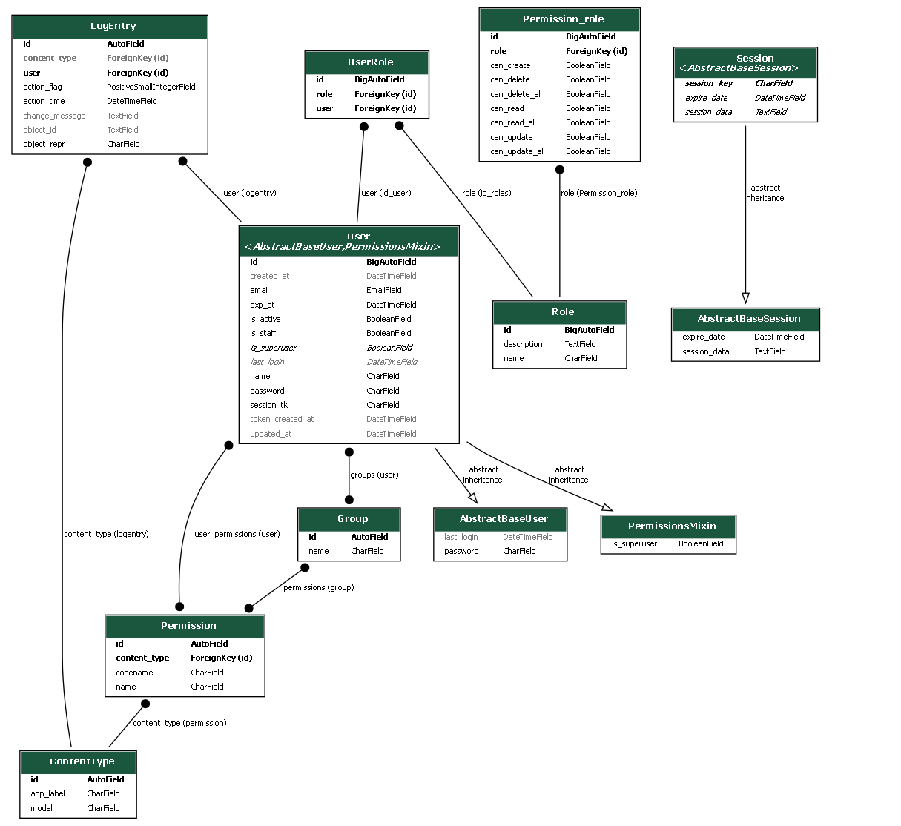

# Test Project


## Система разграничения прав доступа
<p>В системе используются три основных сущности: <b>Пользователь (User), Роль (Role) и Разрешение (Permission_role)</b>.<br> Эти сущности взаимосвязаны, чтобы обеспечить гибкую систему контроля доступа.</p>

1. Пользователь (User)
         <div style="margin-left: 20px;">
         **Содержит:**
            <div style="margin-left: 20px;">
            - Уникальный идентификатор (id)<br>
            - Адрес электронной почты должен быть уникальным (email)<br>
            - Имя пользователя либо ФИО  в одну строку (name)<br>
            - Статусы активности (is_active)<br>
            - Является ли администратором is_staff<br>
            - Даты создания и обновления учетной записи (created_at, updated_at)<br>
            - Поле пароля (password) хранит хешь пароля.
            - Токен сессии, используемый для управления сессиями пользователя, время создания токена и срок его жизини поля (session_tk, token_created_at, exp_at) соответсвенно.
            </div>
        **Отношения:**
            <div style="margin-left: 20px;">
            - Может иметь одну или более ролей через таблицу UserRole.<br>
            - Получает права доступа через роли, которые связаны с таблицей Permission_role.<br>
        </div>
    </div>


2. Роль (Role)
        <div style="margin-left: 20px;">
        **Содержит:**
            <div style="margin-left: 20px;">
           - Поле ForeignKey  устанавливающее связь с таблицей Role (устанавливается связь между роялями и разрешенями)<br>
           - все доступные виды разрешений:<br>
             - can_read - Boolean<br>
             - can_read_all - Boolean<br>
             - can_create - Boolean<br>
             - can_delet - Boolean<br>
             - can_delet_all - Boolean<br>
             - can_udate - Boolean<br>
             - can_update_all - Boolean<br>
            </div>
              </div>

3. Разрешение (Permission_role)
        <div style="margin-left: 20px;">
        **Содержит:**
            <div style="margin-left: 20px;">
            - role - поле отвечает за дву стороннею связ с таблицей  Role (Роли)<br> 
            - business_element - поле отвечающее за  за дву стороннею связ с таблицей BusinessElement<br> 
            - Логические поля принимающее булево значнеие (True, False) не посредствено отвечают за наличие или утсутсвие опредленного права (can_read, can_read_all, can_create, 
            can_update, can_update_all, can_delete, can_delete_all)<br>
            </div>
        **Отношения:**
            <div style="margin-left: 20px;">
           - Может быть связано с множеством ролей через таблицу Role.<br>
           - Может быть связано с множеством ролей через таблицу Role.<br>
            </div>
        </div>
        
5. Сопоставления (UserRole)
        <div style="margin-left: 20px;">
            **UserRole cодержит:**
            <div style="margin-left: 20px;">
               - <u>user_id</u> (внешний ключ на модель User)<br>
               - <u>role_id</u> (внешний ключ на модель Role)<br>
               - Позволяет сопоставлять пользователей с их ролями.<br><br>
             </div>
        
<br>
<br>

**Проверка доступа осуществляется по слежующему сценарию:**
1. Пользователь логинится:
2.  Система хранит информацию о его ролях и разрешениях.
3. Пользователь запрашивает доступ к ресурсу:
  - Система проверяет, есть ли у пользователя активная сессия.
  - Если да, то проверяет, есть ли у пользователя необходимые разрешения через его роли:
      - Если разрешение найдено, доступ разрешён.
      - Если нет, возвращается ошибка 403 Forbidden.

**Графически модель базы данных можно изобразить слеюущим образом**


Код отформатирован в соотвествии с PEP8 (утилита black)

- Для заполенения базы тестовыми данными - ```python manage.py .\manage.py create_user_roles ```

